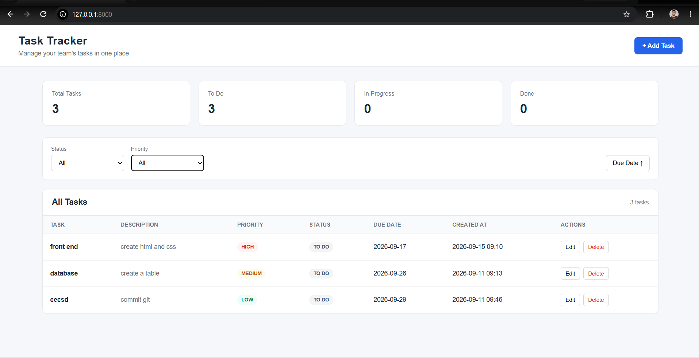

# Task Tracker

A web-based Task Tracker application developed using **Python and Django**, with **MySQL** as the database and **HTML, CSS, and JavaScript** for the frontend. The application allows users to create, view, update, and manage tasks through a simple and user-friendly interface.

## Technologies Used

* **Python** – Backend programming and application logic
* **Django** – Web framework for developing the backend
* **MySQL** – Database for storing task information
* **HTML** – Web page structure
* **CSS** – User interface styling and layout
* **JavaScript** – Client-side interactions
* **Git & GitHub** – Version control and project management

## Key Features

* Create and add new tasks
* View and manage existing tasks
* Update task details
* Delete tasks
* Task status management using radio buttons
* Store task information in MySQL
* Django-based backend with database integration
* Simple and responsive user interface

## REST API

The task collection is available as JSON at `/api/tasks/`.

* `GET /api/tasks/` - list tasks. Optional `status`, `priority`, `q`, and `sort=desc` query parameters are supported.
* `POST /api/tasks/` - create a task.
* `GET /api/tasks/<id>/` - retrieve a task.
* `PUT /api/tasks/<id>/` - replace a task.
* `PATCH /api/tasks/<id>/` - partially update a task.
* `DELETE /api/tasks/<id>/` - delete a task.

Create and update requests must send a JSON object with `task_name`, `task_assignee`,
`task_priority`, and `task_due_date`. `task_description` and `task_status` are optional.

### API examples

Search and filter tasks:

```text
GET /api/tasks/?q=report&status=IN_PROGRESS&priority=HIGH&sort=desc
```

Paginate results with a maximum page size of 100:

```text
GET /api/tasks/?page=1&limit=20
```

Paginated responses include `tasks` and a `pagination` object containing `page`,
`limit`, `total`, and `pages`. Requests without `page` or `limit` retain the
simple full-list response used by the dashboard.

Errors return a consistent JSON shape:

```json
{
  "detail": "Invalid status filter."
}
```

## Development and testing

Run the project checks and tests before opening a pull request:

```powershell
python manage.py check
python manage.py test
```

The test suite covers API CRUD operations, validation failures, filtering,
search, pagination, and malformed JSON requests.

For maintainable changes:

* Keep API behavior documented in this README.
* Keep business validation in the model and API input validation in the API layer.
* Add regression tests for every new endpoint behavior.
* Use focused commits and review `git diff --check` before committing.

## Production documentation checklist

Before deploying, document environment variables, database setup, authentication,
allowed hosts, CORS policy, migrations, backups, logging, and rollback steps.
The current development settings contain local configuration and should not be
used as production settings.

## Project Purpose

The purpose of this project is to provide a simple and efficient way to organize and manage daily tasks while demonstrating practical knowledge of **Python, Django, database management, frontend development, and Git/GitHub**.

The project uses SQLite by default for local development. For an existing MySQL
deployment, set `DB_ENGINE=django.db.backends.mysql`, `DB_NAME`, `DB_USER`,
`DB_PASSWORD`, `DB_HOST`, and `DB_PORT` in the environment. Set
`DJANGO_SECRET_KEY`, `DJANGO_DEBUG`, and `DJANGO_ALLOWED_HOSTS` before running
outside local development.

## Screenshots

Project screenshots are available in [`docs/screenshots`](docs/screenshots).

